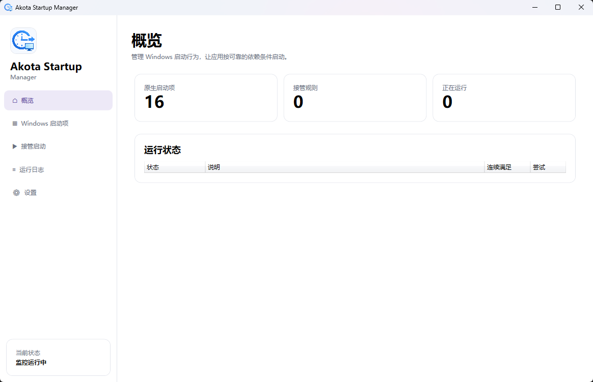

<p align="center">
  
</p>

<h1 align="center">Akota Startup Manager</h1>

> [!NOTE]
> 本项目的代码、界面与文档完全由 AI 编写，并由项目维护者提出需求、审阅和发布。

<p align="center">
  可靠、可恢复、可编排的 Windows 自启动管理器。
</p>

<p align="center">
  <a href="README.en.md">English</a> ·
  <a href="https://github.com/AkotaP/AkotaStartupManager/releases">下载发行版</a> ·
  <a href="https://github.com/AkotaP/AkotaStartupManager/issues">反馈问题</a>
</p>

> [!IMPORTANT]
> 当前项目处于 `0.2.0` 早期版本。修改系统级注册表项、公共启动文件夹或计划任务前，请确认已理解操作影响并保留重要配置备份。

## 为什么使用它？

Windows 原生自启动只能决定“登录后启动”，无法表达“数据库端口已监听”“本地接口已就绪”或“另一个程序的窗口已经出现”。Akota Startup Manager 可以接管这些启动项，持续检测依赖条件，并在条件稳定满足后再启动目标应用。

<p align="center">
  
</p>

## 主要功能

- 管理注册表 `Run` / `RunOnce`（当前用户、系统级、32/64 位视图）
- 管理当前用户和公共启动文件夹
- 管理带开机或登录触发器的 Windows 计划任务
- 禁用原生启动项时保存可恢复备份，不进行不可逆删除；在“备份与恢复”窗口可查看任意一条备份及其可恢复状态并还原
- 将原生启动项直接转换为“接管启动”规则
- 通过工具栏按钮或双击规则行编辑已有接管规则，取消编辑不会改动原配置
- 支持可嵌套的 AND / OR 条件表达式树：
  - **Process**：进程已经存在
  - **TcpPort**：本地 TCP 端口可以连接
  - **Http**：本地 HTTP/HTTPS 接口返回成功状态
  - **FileExists**：指定文件已经生成
  - **WindowsService**：Windows 服务正在运行
  - **WindowTitle**：可见窗口标题出现，可选正则匹配
- 默认每 2 秒检测一次，连续满足 3 次后才判定就绪
- 就绪后延迟、防重复启动、启动存活验证和自动重试
- 单实例、后台随 Windows 启动、托盘快捷菜单和本地日志
- 所有配置、备份、日志均随便携目录保存

## 系统要求

- Windows 10/11 x64
- 使用预编译的 **standalone** 包时，无需预装 .NET
- 使用体积更小的 **runtime** 包时，需要预装 [.NET 10 Desktop Runtime](https://dotnet.microsoft.com/download/dotnet/10.0)
- 从源码构建需要 [.NET 10 SDK](https://dotnet.microsoft.com/download/dotnet/10.0)

## 快速开始

1. 前往 [Releases](https://github.com/AkotaP/AkotaStartupManager/releases)，按需要下载：
   - `AkotaStartupManager-v*-win-x64-standalone.zip`：自包含运行时，下载后即可使用。
   - `AkotaStartupManager-v*-win-x64-runtime.zip`：包体积更小，需要预装 .NET 10 Desktop Runtime。
2. 使用同名 `.zip.sha256` 文件校验 SHA-256，然后将 ZIP 解压到普通用户可写目录。
3. 运行 `AkotaStartupManager.exe`。
4. 在“Windows 启动项”中选择项目进行禁用或接管；被禁用的条目会保存在“备份与恢复”窗口，可随时选择任意一条还原。
5. 在“接管启动”中配置目标程序、稳定性参数和依赖条件；选择规则后点击“编辑规则”或双击规则行可再次修改。

> [!WARNING]
> 不要把便携版放进 `Program Files` 等普通用户不可写目录。系统级启动项操作可能触发 UAC；请勿在不了解用途时禁用系统或安全软件任务。

## 便携数据

程序只在 EXE 所在目录创建运行数据：

```text
Data/
├─ config.json
├─ config.previous.json
└─ Backups/
Logs/
└─ akota-YYYYMMDD.log
```

移动整个程序目录后，请在设置页重新切换一次“随 Windows 启动”，以更新注册表中的 EXE 路径。发行 ZIP 不包含任何现有配置、备份或日志。

## 条件判定与启动流程

```text
循环检查表达式树
  ├─ 失败：连续计数清零，等待下次检查
  └─ 成功：连续计数 +1
       └─ 达到阈值
            └─ 就绪后延迟
                 └─ 检查目标是否已运行
                      ├─ 已运行：跳过重复启动
                      └─ 未运行：启动 → 存活验证 → 必要时重试
```

空条件组属于无效配置。AND 组要求全部启用的子条件满足，OR 组要求至少一个子条件满足。出于 SSRF 防护考虑，HTTP 条件仅接受 localhost 或回环 IP。

## 从源码构建

```powershell
git clone https://github.com/AkotaP/AkotaStartupManager.git
Set-Location .\AkotaStartupManager

dotnet restore .\AkotaStartupManager.slnx
dotnet build .\AkotaStartupManager.slnx -c Release
dotnet test .\AkotaStartupManager.slnx -c Release --no-build
```

生成可上传 GitHub Release 的两种便携 ZIP（standalone 与 runtime）及各自 SHA-256 文件。版本号默认从仓库根目录的 `VERSION` 读取：

```powershell
.\scripts\publish.ps1
```

需要临时覆盖版本号（不会修改 `VERSION`）时，可使用 `-Version`：

```powershell
.\scripts\publish.ps1 -Version 0.1.1-beta.1
```

产物位于 `artifacts\`。推送带新版本号的提交后，GitHub Actions 会自动完成同样的构建并发布 Release，无需手工上传；完整发布方式见 [贡献指南](CONTRIBUTING.md#发布版本)。

## 项目结构

```text
assets/                              品牌图片和仓库截图
src/
├─ AkotaStartupManager.Core/         领域模型和接口
├─ AkotaStartupManager.Application/  编排与启动项业务逻辑
├─ AkotaStartupManager.Infrastructure/ Windows API、持久化和日志
└─ AkotaStartupManager.App/          WPF UI、MVVM 和托盘
scripts/                             可复现的本地发布脚本
tests/                               单元与基础设施测试
```

依赖方向保持为 `Core ← Application ← Infrastructure ← App`。新增条件时实现 `StartupCondition` 和 `IConditionChecker`；新增启动来源时实现 `IStartupProvider`。

## 路线图

- 提升规则编辑器交互与条件即时测试体验
- 增加更全面的隔离 Windows 集成测试
- 增加配置导入、导出与版本迁移界面
- 完善可访问性、国际化和主题支持

路线图不构成发布时间承诺，欢迎通过 Issue 讨论优先级。

## 参与贡献与安全

- 提交代码前请阅读 [CONTRIBUTING.md](CONTRIBUTING.md)。
- 安全问题请按 [SECURITY.md](SECURITY.md) 私下报告，不要在公开 Issue 中附带注册表导出、完整日志或本机敏感路径。
- 版本变化记录见 [CHANGELOG.md](CHANGELOG.md)。

## 许可证

Copyright © 2026 [AkotaP](https://github.com/AkotaP)。

本项目依据 [GNU General Public License v3.0](LICENSE) 发布。分发修改版本时必须遵守 GPL-3.0 的源代码与许可证义务。本软件按“原样”提供，不附带任何担保。
